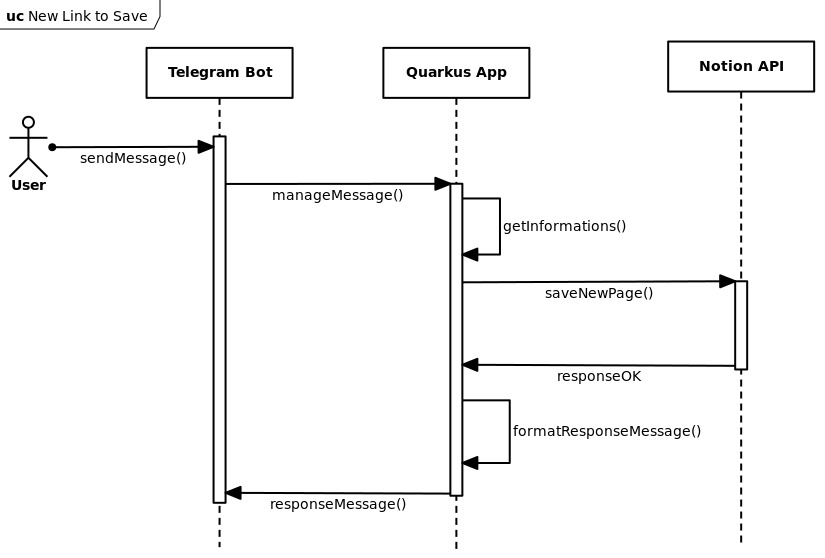

# Telegram2Notion Quarkus Docs

Telegram2Notion is a small application developed with the [Quarkus framework](https://quarkus.io/) with which it is possible to save links that are sent to a Telegram Bot in a Notion database. It is also possible to tag the links sent to the bot with hashtags to better organize your database.

Here is a small demo of the application:

<Vimeo video="763926082" />

## 📦 Used libraries

- [TelegramBots](https://github.com/rubenlagus/TelegramBots): Java library to create bots using Telegram Bots API
- [Project Lombok](https://projectlombok.org/): Spice up your java: Automatic Resource Management, automatic generation of getters, setters, equals, hashCode and toString, and more!
- [jsoup](https://jsoup.org/): jsoup is a Java library for working with real-world HTML. It provides a very convenient API for fetching URLs and extracting and manipulating data, using the best of HTML5 DOM methods and CSS selectors. jsoup implements the WHATWG HTML5 specification, and parses HTML to the same DOM as modern browsers do
- [SmallRye Health](https://quarkus.io/guides/smallrye-health): allows applications to provide information about their state to external viewers where automated processes must be able to determine whether the application should be discarded or restarted

## 🚀 Deploy

As a Quarkus application made with [Maven](https://maven.apache.org/index.html) you can build an _über-jar_ with the following command:

```bash
./mvnw package -Dquarkus.package.type=uber-jar
```

and run on a server with Java installed with

```bash
nohup java -jar telegram2notion-*.jar &
```

more information can be found in the [Quarkus docs](/quarkus-doc) section of the documentation.

## 🤓 Simple Use Case

This diagram shows how the application works

