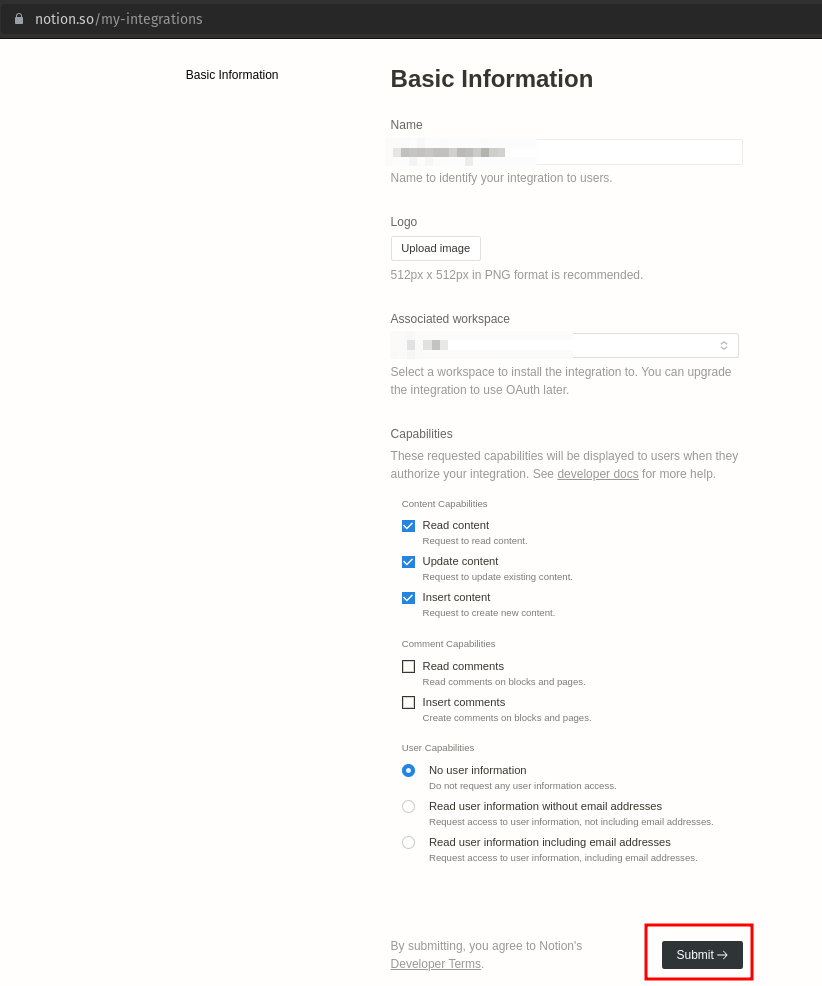
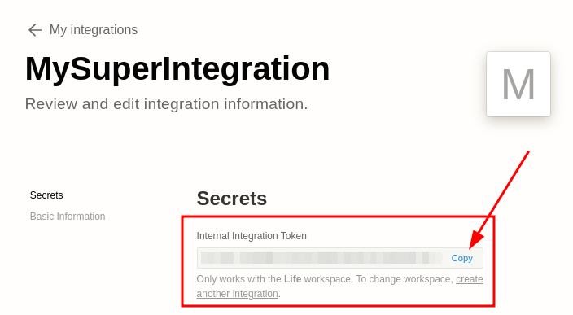
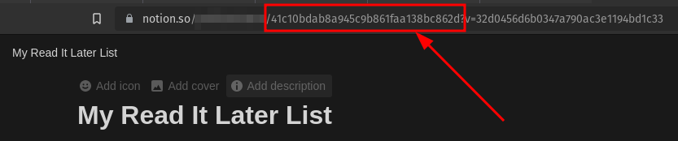

# Configuration

## Telegram

First you have to create a telegram bot using [@BotFather](https://telegram.me/BotFather). Once a conversation began use its commands and click on `/start`. Then follow the procedure:
- On the command list select the command `/newbot` and choose a name for your bot, for example: `MyAwesomeBot`
- Choose an username for your bot, it must end with `bot`, for example: `myawesome_bot`
- At this point Botfather will tell you that the creation has taken place successfully and will send you a message with the token to be used to interact with the bot via HTTP API. We will use this token in the quarkus section
- You can start a new conversation with your bot from the `telegram.me/<bot_username>` to verify that everything was created correctly.

## Notion

First of all you must have a notion account, otherwise register one for free here: [Notion](https://www.notion.so/). After that there are two configuration steps to make the bot works.

### Create an integration

First of all you have to create an integration which is the way in which Notion allows third-party applications to interact with their resources, to do this you have to go to this page: [My integrations](https://www.notion.so/my-integrations), and click on the **+ New Integration** button


On the **Basic Information** page choose a name for your integration, select a workspace in which the extension will be enabled and click on **Submit**. 



Now on the integration page you must get the **Internal Integration Token** which we will need later in the configuration of our application. 



### Create a DB and connet to the integration

At this point we need to create our Notion database which we will then connect to the integration we have just created. Create a new Page and put a new database, choose a title and set the column in this way:

|      read      |     name    |    url    |         tag        |    date    |
|:--------------:|:-----------:|:---------:|:------------------:|:----------:|
| Type: Checkbox | Type: Title | Type: URL | Type: Multi-select | Type: Date |

If you want to launch the project without any modification, give the name to the columns exactly as indicated in the table above. 

Now click on the three dots in the upper right of the page, click on the **add connections** button, select the integration you created earlier and **Confirm**.

If you did everything correctly now your integration is correctly linked to your database. Congrats! 🥳

### Notion Resources

- API documentation: [https://developers.notion.com/reference](https://developers.notion.com/reference)
- Postman Collection: [https://www.postman.com/notionhq/](https://www.postman.com/notionhq/)
- Database object: [https://developers.notion.com/reference/database](https://developers.notion.com/reference/database)
- Page object: [https://developers.notion.com/reference/page](https://developers.notion.com/reference/page)
- Create a page: [https://developers.notion.com/reference/post-page](https://developers.notion.com/reference/post-page)
- Property values: [https://developers.notion.com/reference/property-value-object](https://developers.notion.com/reference/property-value-object)

## Quarkus

Within the Quarkus project, the `application.yaml` file must be created and positioned in the `src->main->Resources` folder, with this content:

```yaml
#QUARKUS
quarkus:
  smallrye-health:
    root-path: /health
  http:
    port: 30090
  rest-client:
    notionclient-api:
      url: 'https://api.notion.com/v1/'
      scope: 'javax.inject.Singleton'
#TELEGRAM
telegram:
  bot:
    username: <YOUR_BOT_USERNAME>
    token: <YOUR_BOT_TOKEN>
    formatted:
      response: 'Page with title: "%1$s" saved in Notion database with tags: %2$s'
#NOTION
notion:
  db: <YOUR_NOTION_DATABASE_ID>
  secret: <YOUR_NOTION_SECRET_KEY>
  version: '2022-06-28'
```

Some indications:

- `<YOUR_BOT_USERNAME>`: is the username that you choose for your bot in the [Telegram](#telegram) section, ex: `myawesome_bot`
- `<YOUR_BOT_TOKEN>`: is the token that Botfather sends you back when you create a new bot
- `<YOUR_NOTION_DATABASE_ID>`: is the id of your notion database that you can read in the url of your database page
  
- `<YOUR_NOTION_SECRET_KEY>`: is the **Internal Integration Token** that you get in the **Secrets** tab of your integration